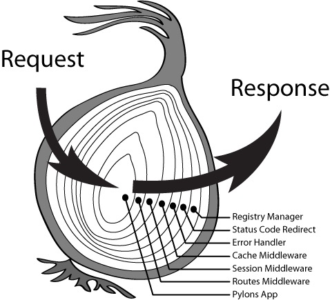

<!-- START doctoc generated TOC please keep comment here to allow auto update -->
<!-- DON'T EDIT THIS SECTION, INSTEAD RE-RUN doctoc TO UPDATE -->
**Table of Contents**  *generated with [DocToc](https://github.com/thlorenz/doctoc)*

- [KOA2中间件的原理及其实现](#koa2%E4%B8%AD%E9%97%B4%E4%BB%B6%E7%9A%84%E5%8E%9F%E7%90%86%E5%8F%8A%E5%85%B6%E5%AE%9E%E7%8E%B0)
  - [1. 中间件的使用](#1-%E4%B8%AD%E9%97%B4%E4%BB%B6%E7%9A%84%E4%BD%BF%E7%94%A8)
  - [2. 中间件的调用顺序](#2-%E4%B8%AD%E9%97%B4%E4%BB%B6%E7%9A%84%E8%B0%83%E7%94%A8%E9%A1%BA%E5%BA%8F)
  - [3. 中间件分析](#3-%E4%B8%AD%E9%97%B4%E4%BB%B6%E5%88%86%E6%9E%90)

<!-- END doctoc generated TOC please keep comment here to allow auto update -->

## KOA2中间件的原理及其实现

### 1. 中间件的使用

1. 通过`app.use(function)`调用。将给定的中间件方法添加到此应用程序中。在Koa2中，use()不接收path参数，所以只要发起请求，就会调用这个中间件。

2. 在Koa2中，中间件全部通过app.use()挂载到app上。不在路由处理中添加中间件，因为在Koa2中，路由本身就是中间件。

### 2. 中间件的调用顺序

- 在Koa2中，路由是按照洋葱圈模式调用。不是按照先后顺序进行调用。如下图所示：  

   

### 3. 中间件分析

1. app.use()用来注册中间件，先收集起来
   - 通过app.use()注册一个中间件。那么这些中间件会按照顺序被收集起来，等待被调用。

2. 实现next机制，上一个通过next触发下一个

3. 与Express不同的是：Koa2的中间件不涉及到method和path的判断。