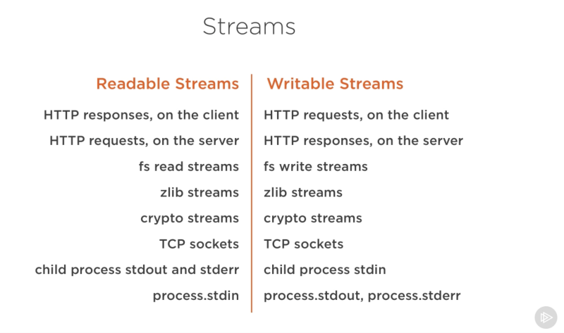

## Node中的流（Streams）

### 1. 参考资料
- [Node.js Stream(流)](https://juejin.im/post/6844903583477923848)
- [Node.js 可读流和可写流](https://juejin.im/post/6844903588649500679)
- [Node.js 中的一股清流：理解 Stream（流）的基本概念](https://juejin.im/post/6844904014975500301)
- [你应该知道的Node.js流](https://juejin.im/post/6844903590859898887)
- [一文搞定 Node.js 流 （Stream）](https://juejin.im/post/6854573219060400141)

### 1. 流（Streams）的说明

1. 流（Streams），流指的是一组有方向的、有起点和终点的一种传输数据的方式。字符串、数组、二进制数据等，都可以以流的方式进行传输。

2. Node 中许多 API 都实现了流，如下图所示：

   
   
3. 流的特点在于，不会一次性将所有的数据读入内存，而一块一块的读，一块一块的进行处理。这种处理方式，使得我们在处理大文件的时候，非常高效。
   
4. 所有的流都是 EventEmitter 的实例。他们在数据可读或者可写的时候发出事件。然而，我们也可以简单的通过 pipe() 方法来使用流数据。

### 2. 可读流（Readable Streams）
1. 可读流分为两种模式：
   - `flowing` 模式：可读流自动(不断的) 从底层读取数据（直到读取完毕），并通过 `EventEmitter` 接口的事件尽快将数据提供给应用
   - `paused` 模式：必须显示调用 `stream.read()` 方法来从流中读取数据片段

### 4. 可写流（Writable Streams）

### 4. 管道（Pipe）

### 5. 双向流（Duplex Streams）

### 6. 转换流（Transform Streams）